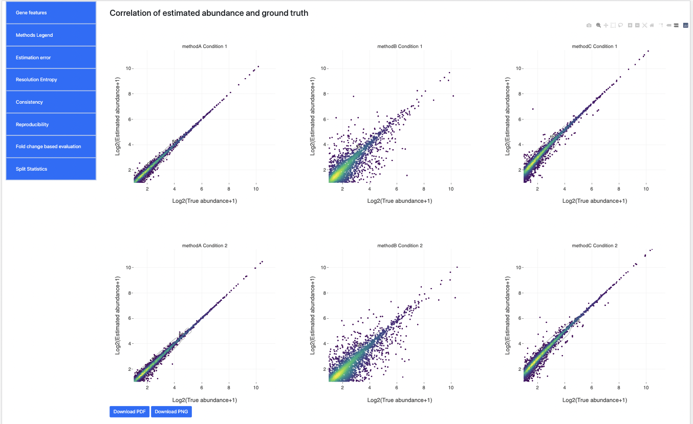

# LRGASP visualization
## Requirements
Running python 3.7 and linux64 on your machine
## Install
```
git clone https://github.com/Tidesun/LRGASP_visualization.git
cd LRGASP_visualization
python -m venv base
source base/bin/activate
pip install --upgrade pip
pip install -r requirements.txt
```
## Usage
### Organizer reporter
```
source base/bin/activate
python encode_quantification/main.py -a ANNOTATION -r RESULT -t TRUTH -o OUTPUT --num_method NUM_METHOD  --num_samples NUM_SAMPLES
```
```
Quantification evaluation reporter

optional arguments:
  -h, --help            show this help message and exit

required named arguments:
  -a ANNOTATION, --annotation ANNOTATION
                        The path of annotation file [GTF]
  -r RESULT, --result RESULT
                        The path of quantification result file [TSV\ZIP]
  -t TRUTH, --truth TRUTH
                        The path of true expression file [TSV]
  -o OUTPUT, --output OUTPUT
                        The path of output directory
  --num_method NUM_METHOD
                        Whether multi method data given ['Single' or 'Multi']
  --num_samples NUM_SAMPLES
                        Whether multi sample data given ['Single' or 'Multi']
```
## Example
### Single method evaluation
Here, to evaluate quantification result for one method,use
```
source base/bin/activate
python encode_quantification/main.py \
-a chr1.gtf \
-r methodA.tsv \
-t truth.tsv \
-o reports \
--num_method Single \
--num_samples Multi
```
`MethodA.tsv` is the quantification result and `truth.tsv` is the expression ground truth. Both are in the format defined in (https://github.com/LRGASP/lrgasp-submissions/blob/master/docs/expression_matrix_format.md)
It will generate a `Report.html` in `reports` folder, consisting of different evaluation metrics based on the input. 
### Multiple methods evaluation
To evaluate multiple methods quantification results, use
```
source base/bin/activate
python encode_quantification/main.py \
-a chr1.gtf \
-r methods.zip \
-t truth.tsv \
-o reports \
--num_method Multi \
--num_samples Multi
```
Here `methods.zip` packs multiple methods quantification results. Noted each method in the reports will be named based on the given file name in the zip file. 
## Example report screenshot
