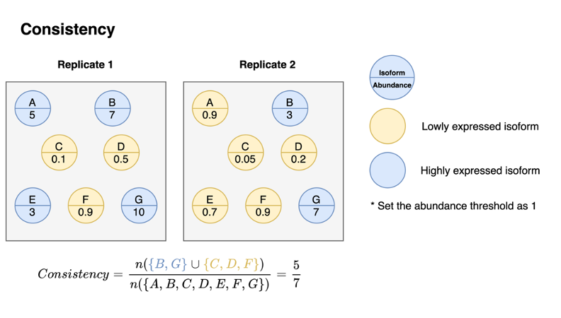

# How the evaluation metrics works
## Spearman Correlation Coefficient (SCC)
SCC evaluates the monotonic relationship between the estimation and gold standard, which is based on the rank for gene isoform abundance rather than the raw data. It is computed as 
 
where  and  are the ranks of  and , respectively, and  is the covariance of the rank variables,  and  are the sample standard deviations of   and , respectively. 
 
Spearman Correlation Coefficient (SCC) between the estimation and gold standard. The SCC reveals gene CDY1 can be accurately quantified but not gene METTL9.
## Abundance Recovery Rate
Abundance Recovery Rate (ARR) represents the percentage of the estimated value to the real abundance, which is calculated by  
 
An accurate estimation should have the ARR value close to 100%.
## Median Relative Difference
Median Relative Difference (MRD) represents the median of relative difference for abundance estimates in all gene isoforms, which can be calculated by 
 
A small MRD value indicates good performance of abundance estimation.
## Normalized Root Mean Square Error
Normalized Root Mean Square Error (NRMSE) gives a measure of the extent to which the relationship deviates from a one-to-one linear relationship. It can be computed by 
 
where  is the sample standard deviation of . A good performance of abundance estimation should have a small value of NRMSE.
Since quantification performance could be influenced by the exon-isoform structure and the abundance, we evaluate the quantification of different sets of genes/transcripts with different isoform features, including isoform numbers, exon numbers, gold standard abundance values and a customized  statistic  K-value representing the complexity of exon-isoform structures.
## K-value
 
K-value is the condition number of the exon-isoform binary matrix, which can be used to measure the complexity of exon-isoform structures for each gene.
## Reproducibility
 
By fitting the standard deviation versus average isoform abundance into a smooth curve, it can be shown that Method B has a lower standard deviation and higher reproducibility.
## Consistency
 
By setting an expression threshold (e.g., 1 in this toy example), we can define which set of genes express (in blue) or not (in yellow). This statistic is to measure the consistency of the expressed gene sets between replicates. 
## Resolution entropy
 
(A) The software output only a few certain discrete values has lower resolution entropy as it cannot capture the continuous and subtle difference of gene expressions. (B) The software with continuous output values has higher resolution entropy.
## Fold-change-based evaluation
 
By counting the # of transcripts that are differentially expressed, statistics such as precision, recall, and accuracy can be defined and calculated.
## Evaluation with different gene features
 
Explore the relationship between the above evaluation metrics and important features like K-value, expression level, isoform length, and number of exons by splitting the transcripts into groups on these features.
